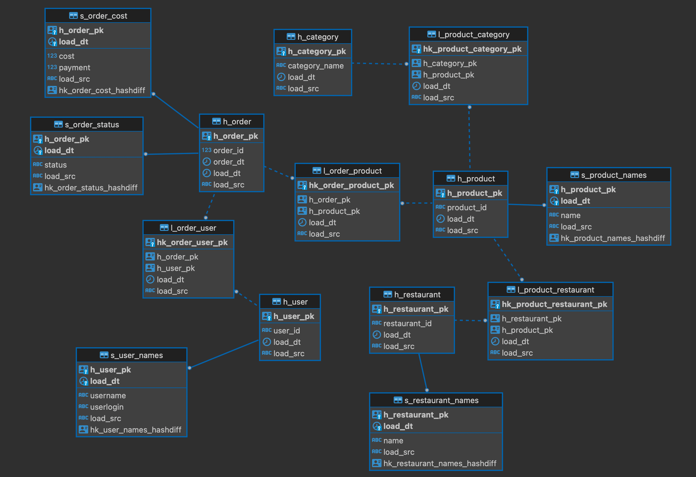

## **Цели проекта**  

- Создать на платформе Yandex Cloud три сервиса, которые реализуют ETL процесс
- Визуализировать данные из новой витрины в дашборде в Datalense

## **Используемые технологии и инструменты**
Yandex Cloud Services  
Datalense  
Kubernetes    
kubectl  
Kafka  
kcat  
confluent_kafka  
flask  
docker   
Redis  

## **Постановка задачи**

В проекте реализованы сбор данных из разных источников о транзакционной активности пользователей и доставка данных в хранилище.

Целевая модель сервисов

Используемая модель данных в PostgreSQL

**Сервис STG**
1. Собирает данные из системы-источника по двум каналам: поток заказов в Kafka, словарные данные в Redis.
2. Записывает данные по заказам в базу PostreSQL (без изменения).
3. Обогащает данные по заказам словарными данными и формирует выходное сообщение, отправляет сообщение в топик Kafka.

**Сервис DDS**
1. Вычитывает обогащенные данные из топика Kafka (сервиса STG).
2. Заполняет релевантные для этого слоя таблицы базы PostgreSQL.
3. Отправляет спроектированное выходное сообщение в топик Kafka.

**Сервис CDM**
1. Вычитывает данные из топика Kafka (сервиса DDS).
2. Наполняет витрины слоя полученными данными.

В сервисах соблюдена идемпотентность обработки сообщений. 

**Подключить к DataLens хранилище**

В DataLens создать датасет для построения графиков на основе слоя витрин из хранилища.
Создать дашборд, который будет включать в себя такие графики: 
- круговая диаграмма, показывающая популярность категорий блюд на основе доли пользователей, которые заказывали блюда этой категории;
- круговая диаграмма, показывающая популярность категорий блюд на основе доли заказов, в которых были блюда этой категории;
- столбчатая диаграмма, показывающая популярность блюд по количеству уникальных пользователей, заказавших блюдо;
- столбчатая диаграмма, показывающая популярность блюд по количеству заказов, в которых было блюдо.

## **Реализация**

1. Ссылка на первый сервис - stg-service
	* `cr.yandex/crpn9s4lgmuu94mqmc67/stg_service:v2024-03-17-r1 `
2. Ссылка на второй сервис - dds-service
	* `cr.yandex/crpn9s4lgmuu94mqmc67/dds_service:v2024-03-17-r1`
3. Ссылка на второй сервис - cdm-service
	* `cr.yandex/crpn9s4lgmuu94mqmc67/cdm_service:v2024-03-17-r1`
4. Ссыка на дашборд
	* `_`

Сборка и сохранение образов:  
docker build . -t cr.yandex/crpn9s4lgmuu94mqmc67/<stg/dds/cdm>_service:v2024-03-17-r1
docker push cr.yandex/crpn9s4lgmuu94mqmc67/<stg/dds/cdm>_service:v2024-03-17-r1

Развертывание образов в Kubernetes с помощью helm:  
...\helm upgrade --install <stg/dds/cdm>-service app -n c19-kostroma-irina

Проверка работы в Kubernetes
- kubectl get deployments
- kubectl get pods  
- kubectl logs -f <имя пода>  
